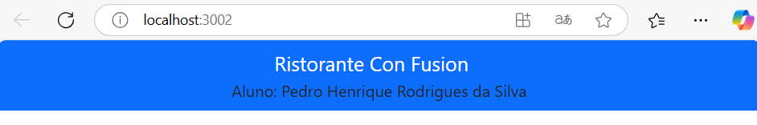

# Getting Started with Create React App

1- Instalar dependências:
No terminal, execute os seguintes comandos para instalar o Reactstrap, Bootstrap e Popper:

npm install reactstrap react react-dom
npm install --save bootstrap
npm install react-popper @popperjs/core

2- Foi Configurado o Bootstrap:
Abra o arquivo index.js na pasta src e adicione a seguinte linha para importar o CSS do Bootstrap:

import 'bootstrap/dist/css/bootstrap.min.css';

3- Foi adicionado a barra de navegação (Navbar):
No arquivo App.js, apague o conteúdo entre as tags <header></header> e substitua pelo código abaixo:

import { Navbar, NavbarBrand } from 'reactstrap';

<Navbar dark color="primary">
  

    <NavbarBrand href="/">Ristorante Con Fusion</NavbarBrand>
    
Aluno: [Seu Nome]

  

</Navbar>

4- Atualizar o README com as alterações da atividade descrevendo passo a passo do que foi feito:
Incluindo a imagem do resuntado apois o npm start. 

5- Subir para o git hub toda a atividade.

Explicação do codigo(NavBar) do passo 3: 

1- <Navbar dark color="primary">:
Cria uma barra de navegação com o tema escuro e o fundo da cor azul

2-  
: 
Deixa centralizado o conteúdo e aplica um espaço apropriado usando o container do Bootsrap. 

3- <NavbarBrand href="/">Ristorante Con Fusion</NavbarBrand>:
Mostra o nome do site, "Restorante Con Fusion", como um link que leva á pagina inicial. 

4- 
Aluno: Fulano de Tal
:
Mostra o nome do aluno na barra de navegação

5- Fechamento do <Navbar>:
Finaliza a barra do navegador, organizando o conteúdo de forma correta.
